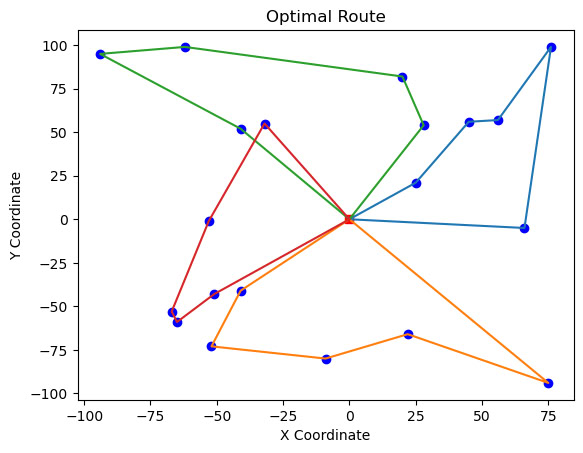
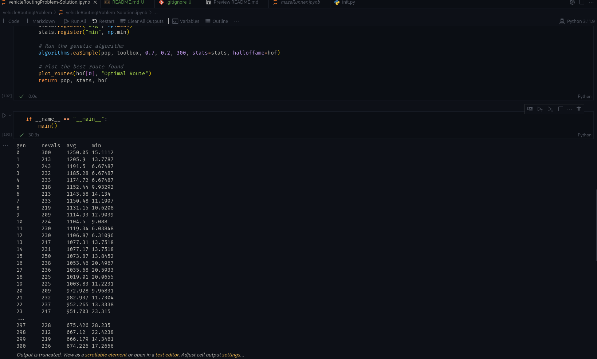

# Genetic Algorithm for Vehicle Routing Problem (VRP) 🚚🧬

A Python-based implementation of a Genetic Algorithm (GA) for solving the
Vehicle Routing Problem (VRP). The project uses the DEAP evolutionary
computation framework to optimize routes for multiple vehicles with the
objective of minimizing total travel distance.

## 📌 Project Overview

The Vehicle Routing Problem (VRP) is a classical optimization problem in
Operations Research and Supply Chain Management. Given a set of locations
and multiple vehicles, the objective is to determine efficient vehicle
routes while minimizing the overall travel distance.

This project applies a Genetic Algorithm, an evolutionary optimization
technique, to search for efficient routing solutions.

The implementation is provided as a Jupyter Notebook and includes route
optimization, fitness evaluation, and visualization of the obtained
solutions.

## 🎯 Objectives

- Optimize routes for multiple vehicles.
- Minimize total travel distance.
- Evaluate candidate routing solutions using a fitness function.
- Apply evolutionary operators to improve routing solutions over generations.
- Visualize optimized routes and fitness evolution.

## 🧬 Genetic Algorithm Approach

The project uses the following evolutionary process:

1. Generate an initial population of candidate routing solutions.
2. Evaluate each solution using a fitness function.
3. Select better-performing individuals.
4. Apply crossover to generate new solutions.
5. Apply mutation to introduce variation.
6. Evaluate the new population.
7. Repeat the process over multiple generations.
8. Obtain an optimized routing solution.

The implementation uses the **DEAP** library for evolutionary computation.

## 🛠️ Technologies Used

- **Python**
- **DEAP** – Genetic Algorithm / evolutionary computation
- **NumPy** – Numerical operations
- **Matplotlib** – Route and fitness visualization
- **Jupyter Notebook** – Interactive development and execution

## 📊 Results & Visualization

The notebook generates visualizations to analyze the optimization process.

### Optimized Routes



*Visualization of the optimized vehicle routes.*

### Fitness Evolution



*Fitness evolution across generations during the optimization process.*

## 🚀 Getting Started

### 1. Clone the repository

```bash
git clone https://github.com/KavyaKunchaparthi/Genetic-Algorithm-for-VRP.git
cd Genetic-Algorithm-for-VRP/Project
